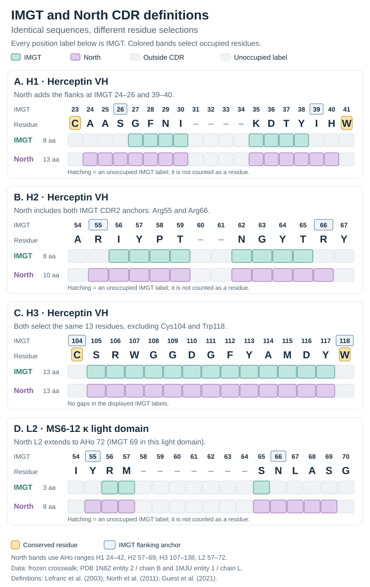

**A CDR definition specifies which residues belong to each complementarity-determining region.** [[Antibody numbering]] specifies the labels attached to those residues. These are separate choices: “Chothia numbering with Kabat CDRs” is meaningful, whereas “the CDR sequence” is incomplete unless its definition is stated. This page collects the boundary conventions; [[Complementarity-determining regions]] covers the loops' biology, conformations, and dynamics.

The literature contains **several kinds of CDR definitions**: conventional numbered intervals, shortened or extended intervals for a particular analysis, unions of existing definitions, and alignment-derived antigen-binding regions. Contact-based residue selections are also used in humanization. These approaches need different kinds of equivalence information; an alignment-dependent method cannot be reduced to six universal endpoint numbers.

## What is being defined?

| Term | What it identifies | What it does not establish |
| --- | --- | --- |
| **Hypervariable region** | Sequence positions that vary strongly across an aligned collection of receptors | Whether a residue contacts antigen in a particular complex |
| **Structural loop** | A region joining elements of the immunoglobulin fold; a study may include flanking strand residues as anchors | A unique universally accepted start and end for every analysis |
| **CDR definition** | A reproducible convention for selecting residue intervals | That every selected residue is variable, flexible, or antigen-contacting |
| **Paratope / antigen-contacting residues** | The receptor surface contacting a particular antigen; the observed set depends on the complex and contact criterion | That the contact set is identical to one of the conventional CDR intervals |
| **Energetic hotspot** | A residue whose perturbation substantially changes binding energetics | That all contacting residues contribute equally to affinity |

The sequence, structural, and contact perspectives explain why the conventions disagree. Wu and Kabat analyzed sequence variability [@wukabat1970], Chothia and Lesk compared loop conformations [@chothia1987], and MacCallum and colleagues measured antibody–antigen contacts [@maccallum1996]. The term *framework* is also definition-dependent at a CDR's edges: being outside a chosen CDR does not make a residue irrelevant to binding or loop geometry.

## Definitions and their origins

| Definition | Basis and purpose | Primary reference; interpretation |
| --- | --- | --- |
| **Kabat** | **Sequence variability.** Selects hypervariable intervals in aligned antibody sequences. | Wu & Kabat (1970) established the variability approach from light-chain sequences; the mature heavy/light convention appears in the Kabat compilations [@wukabat1970; @kabat1991]. |
| **Chothia** | **Structure.** Identifies regions involved in the canonical conformations of antibody loops. | Chothia & Lesk (1987), extended by Al-Lazikani, Lesk & Chothia (1997). Historical papers and later implementations do not all use identical boundaries [@chothia1987; @allazikani1997]. |
| **AbM** | **Antibody modeling.** Uses a practical selection of loops associated with the AbM modeling system, combining sequence and structural considerations. | Martin, Cheetham & Rees (1989) describes the underlying combined modeling approach. The conventional AbM intervals are listed below; **AbM CDRs are not Martin numbering** [@martin1989; @abhinandan2008]. |
| **IMGT** | **Sequence and structural correspondence.** Defines homologous regions between conserved framework anchors, using a shared V-domain coordinate system. | Lefranc et al. (2003). The convention applies across IG and TR V-domains and distinguishes CDRs from their flanking anchors [@lefranc2003]. |
| **Contact / MacCallum** | **Observed antigen contacts.** Selects intervals from residue contact and burial patterns in antibody–antigen crystal structures. | MacCallum, Martin & Thornton (1996). This is a population-derived interval definition, not a contact prediction for each residue of a new antibody [@maccallum1996]. |
| **North–Dunbrack / PyIgClassify** | **Structural alignment and conformational clustering.** Selects endpoints near stable framework positions, with approximately corresponding boundaries in VH and VL; L2 is an exception. | North, Lehmann & Dunbrack (2011). The loops extend farther into flanking structure than some narrower Chothia definitions; their lengths are used in conformational cluster names [@north2011]. |
| **Padlan abbreviated CDRs** | **Sequence variability and antigen contacts.** Shortened intervals intended to retain potential specificity-determining residues. | [Padlan, Abergel & Tipper (1995)](https://doi.org/10.1096/fasebj.9.1.7821752); the six intervals are explicitly reproduced by [Tamura et al. (2000), p. 1439](https://doi.org/10.4049/jimmunol.164.3.1432). |
| **Almagro SDR regions / SDRU** | **Antigen contacts.** Observed region envelopes and normalized contact-usage scores. | [Almagro (2004)](https://doi.org/10.1002/jmr.659). Related functional definitions, with their envelopes distinguished from an individual antibody's contacts. |
| **Paratome ABRs** | **Structural contact consensus.** Three antigen-binding regions per variable domain, transferred to a query through sequence or structure alignment. | [Kunik, Peters & Ofran (2012)](https://doi.org/10.1371/journal.pcbi.1002388), with the sequence/structure server described by [Kunik, Ashkenazi & Ofran (2012)](https://doi.org/10.1093/nar/gks480). Often called “Paratome CDRs” in engineering papers. |
| **Nowak extended Chothia** | **Structural classification.** Adds two N-terminal H2 residues to the common Chothia selection; retains its other five intervals. | Nowak et al. (2016) selected this extension after testing effects on cluster prediction [@nowak2016]. |
| **General CDR, Zhu et al.** | **Composite for comparative analysis.** Union of the Kabat, Chothia/consensus, AbM, and IMGT selections considered in that study. | [Zhu, Olson & Magliery (2024), Table 1 and §2.2](https://doi.org/10.3390/antib13040099). “General” is the paper's name for this union, not an established universal standard. |
| **Combined Kabat/IMGT/Paratome** | **Composite for humanization.** Grafts the combined residue selections onto a human framework. | [Zhang & Ho (2017)](https://doi.org/10.1080/19420862.2017.1289302) tested this approach in rabbit antibodies. Its selection depends on the component annotations. |
| **WolfGuy composite** | **Union of Kabat and Chothia CDR residue sets.** Used in structure modeling together with WolfGuy's separate numbering system. | Bujotzek et al. (2015), particularly the *MoFvAb* methods. The union is taken over corresponding residues, not over numbers from different schemes [@bujotzek2015; @bujotzek2015mofvab]. |

**AHo is a numbering scheme, not an independently fixed CDR definition.** Its structural alignment provides useful coordinates for North/PyIgClassify loops; naming AHo alone does not specify those boundaries [@honegger2001; @north2011]. Gelfand–Kister structural segments describe the fold [@gelfand1995], EU numbers describe a reference immunoglobulin sequence [@edelman1969], and ANARCI/ANARCII assign residue labels [@dunbar2016; @greenshieldswatson2026]. When selecting CDRs, specify the boundary convention as well as the residue labels.

## Boundary reference

### Heavy- and light-chain boundaries across definitions

**Read the numbering column before using an interval.** Kabat uses Kabat labels, IMGT uses IMGT labels, and North/PyIgClassify uses AHo labels. Padlan and Zhu's general definition use Kabat labels. The remaining rows express their boundaries in Chothia labels. H and L identify heavy and light variable domains. Intervals are inclusive and contain insertion-coded residues assigned within them; they are not offsets into an unnumbered sequence. Paratome and contact-based selections are described in the rule table immediately after these fixed-coordinate tables.

**Heavy-chain variable domain (VH)**

| CDR definition | Numbering | H1 | H2 | H3 |
| --- | --- | --- | --- | --- |
| Kabat | **Kabat** | H31–H35† | H50–H65 | H95–H102 |
| Common Chothia | **Chothia** | H26–H32 | H52–H56 | H95–H102 |
| Chothia consensus (Zhu 2024) | **Chothia** | H26–H32 | H52–H56 | H96–H101 |
| Nowak 2016 | **Chothia** | H26–H32 | H50–H56 | H95–H102 |
| AbM | **Chothia** | H26–H35 | H50–H58 | H95–H102 |
| **IMGT** | **IMGT** | **27–38** | **56–65** | **105–117** |
| **North / PyIgClassify** | **AHo** | **24–42** | **57–69** | **107–138** |
| Contact / MacCallum | **Chothia** | H30–H35 | H47–H58 | H93–H101 |
| WolfGuy composite | **Chothia** | H26–H35 | H50–H65 | H95–H102 |
| Padlan abbreviated | **Kabat** | H31–H35B‡ | H50–H58 | H95–H101 |
| General (Zhu 2024) | **Kabat** | H26–H35† | H50–H65 | H93–H102 |

† Include H35 insertion-coded residues when present; the general definition is implemented as a union of the component residue sets.

**Light-chain variable domain (Vκ/Vλ)**

| CDR definition | Numbering | L1 | L2 | L3 |
| --- | --- | --- | --- | --- |
| Kabat | **Kabat** | L24–L34 | L50–L56 | L89–L97 |
| Common Chothia | **Chothia** | L24–L34 | L50–L56 | L89–L97 |
| Chothia consensus (Zhu 2024) | **Chothia** | L26–L32 | L50–L52 | L91–L96 |
| Nowak 2016 | **Chothia** | L24–L34 | L50–L56 | L89–L97 |
| AbM | **Chothia** | L24–L34 | L50–L56 | L89–L97 |
| **IMGT** | **IMGT** | **27–38** | **56–65** | **105–117** |
| **North / PyIgClassify** | **AHo** | **24–42** | **57–72** | **107–138** |
| Contact / MacCallum | **Chothia** | L30–L36 | L46–L55 | L89–L96 |
| WolfGuy composite | **Chothia** | L24–L34 | L50–L56 | L89–L97 |
| Padlan abbreviated | **Kabat** | L27D–L34‡ | L50–L55 | L89–L96 |
| General (Zhu 2024) | **Kabat** | L24–L34 | L50–L56 | L89–L97 |

‡ These are the published abbreviated-CDR endpoints in Kabat coordinates. **L27D and H35B are insertion labels**, not ordinary sequence positions. A short loop may lack such labels: preserve the source alignment and state the actual selected residues; do not silently replace L27D with L27. The long-L1 example below contains L27D and demonstrates the selection directly. The source of these endpoints is [Tamura et al. (2000), discussion](https://doi.org/10.4049/jimmunol.164.3.1432), crediting Padlan et al. (1995).

### Definitions specified by a selection rule

| Approach | What determines the selected residues? | Coordinates to report |
| --- | --- | --- |
| **Paratome ABRs** | Transfer six reference ABR boundaries through an alignment of the query's sequence or structure | Actual query sequence positions or PDB residue identifiers; no universal six-interval Kabat/IMGT table |
| **Combined Kabat/IMGT/Paratome** | Union of the component annotations on the same antibody | A common numbering system plus the actual union; the Paratome alignment is part of its provenance |
| **Specificity-determining residues (SDRs)** | Observed or inferred antigen-contacting residues, potentially refined by functional experiments | Individual selected residues and the contact/experimental criterion; a set need not be contiguous |
| **Specificity-determining residue usage (SDRU)** | Normalized position-wise contact usage, stratified by antigen class | Alignment, antigen class, contact criterion, and selection threshold; not one universal H1–L3 boundary set |

Paratome's operational rules are documented in its [method](https://doi.org/10.1371/journal.pcbi.1002388) and [server](https://doi.org/10.1093/nar/gks480) papers; the combined graft in [Zhang & Ho (2017)](https://doi.org/10.1080/19420862.2017.1289302). The SDR concept and abbreviated intervals originate with [Padlan et al. (1995)](https://doi.org/10.1096/fasebj.9.1.7821752); SDRU is developed by [Almagro (2004)](https://doi.org/10.1002/jmr.659). The sections below distinguish these related approaches.

IMGT's intervals apply to rearranged IG and TR variable domains [@lefranc2003]. North/PyIgClassify's AHo endpoints are explicitly listed by Guest et al.; **North L2 ends at AHo72, whereas H2 ends at AHo69** [@guest2021]. Equal-looking integers across numbering systems do not identify equal residue sets. The dedicated sections below explain their anchors and gap handling.

Kabat's native-coordinate boundaries follow its compiled convention [@kabat1991]. Common Chothia and Contact boundaries follow [MacCallum's author-hosted comparison, Table 2.3](https://nucpred.bioinfo.se/thesis/node66.html). AbM and the separately labeled consensus implementation are tabulated in [Zhu et al. (2024), Table 1](https://pmc.ncbi.nlm.nih.gov/articles/PMC11672675/). Zhu and colleagues attribute their consensus interpretation to the Martin group's 2021 documentation; this row reproduces **their stated implementation**. The WolfGuy row is the residue-set union described in *MoFvAb* [@bujotzek2015mofvab]. In particular, this Contact version starts **L2 at L46**; if a program or paper uses L45, record that variant explicitly.

“Common Chothia” here identifies the displayed practical convention, **not a claim that every Chothia paper used these six intervals**. The original work examined shorter structural cores for several loops: its 1987 section 3 gives H2 as H53–H55, while section 11 uses H52–H56. Later canonical-structure analyses also distinguished κ and λ L1 boundaries. Reproducing a historical canonical-class analysis requires its actual loop sequences and endpoints, not just the name “Chothia” [@chothia1987; @allazikani1997].

**Insertion placement matters most when translating H1 and L1.** For example, Kabat H1 can extend through H35A/H35B, whereas the corresponding extra labels in Chothia H1 are placed elsewhere. The common Chothia H1 ending at H32 corresponds to a Kabat endpoint that can shift with loop length. Use the [IMGT length-specific correspondence tables](https://www.imgt.org/IMGTScientificChart/Numbering/IMGTcorrespondence.html) or map the actual sequence; do not translate an interval by copying its endpoint integers [@abhinandan2008].

## IMGT: homologous regions between framework anchors

**IMGT defines CDR1, CDR2, and CDR3 in one V-domain coordinate system shared by antibody heavy/light chains and TCR α/β/γ/δ chains.** Its sequence alignments incorporate structural correspondence and conserved framework landmarks. The regions surround the BC, C′C″, and FG connections, respectively; their boundaries are annotations of homologous regions, not a requirement that every included residue be classified as coil in a particular crystal structure [@lefranc2003].

| Region | IMGT positions included | Flanking IMGT anchors, excluded | Structural context |
| --- | --- | --- | --- |
| CDR1-IMGT | 27–38 | 26 and 39 | B–C connection; first conserved Cys23 lies farther into FR1, and core Trp41 into FR2 |
| CDR2-IMGT | 56–65 | 55 and 66 | C′–C″ connection in the conventional IG/TR V-domain fold |
| CDR3-IMGT | 105–117, including additional apex positions | Cys104 and J-Phe/Trp118 | F–G connection in a rearranged variable domain |

The flanking anchors belong to framework, even when their side chains support a CDR or contact antigen. For a complete V-domain the intervening framework intervals are FR1 1–26, FR2 39–55, FR3 66–104, and FR4 118–129 (depending on J-region length) [@lefranc2003].

**Gaps preserve labels; they do not add amino acids.** In the structural display, an eight-residue CDR1 occupies 27–30 and 35–38, leaving 31–34 empty. An eight-residue CDR2 occupies 56–59 and 62–65. For a CDR3 shorter than 13 residues, gaps are introduced in the order 111, 112, 110, 113, and outward. Thus Herceptin has CDR-IMGT lengths **[8.8.13]**, although the standard reserved spans contain 12, 10, and 13 integer labels. Longer CDR3 loops add positions between 111 and 112: a 15-residue loop contains the local sequence of labels `111, 111.1, 112.1, 112`. The extra labels are ordered by their place along the chain, not as decimal numbers. [IMGT's occupied-position tables](https://www.imgt.org/IMGTScientificChart/Numbering/IMGTIGVLsuperfamily.html).

**Gap placement can also depend on the IMGT display.** Structural resources place CDR1/CDR2 gaps near the apex; V-QUEST sequence displays can place them at the interval's end. This leaves CDR membership and length unchanged but changes which occupied residue receives an internal label. State the tool/display when comparing individual positions. [IMGT FAQ on sequence and structural gap placement](https://www.imgt.org/FAQ/). The worked examples and diagram on this page use the frozen ANARCII assignments, which follow the structural placement shown here.

Three CDR3-related objects must be distinguished:

| Object | What is included |
| --- | --- |
| **Germline V-gene CDR3-IMGT annotation** | The V gene's terminal portion, conventionally within positions 105–116; this is not the completed rearranged CDR3. |
| **Rearranged CDR3-IMGT** | The complete segment between Cys104 and J-Phe/Trp118, excluding both anchors; labels 105–117 with gaps or extra positions. |
| **IMGT JUNCTION** | Rearranged CDR3 plus its two anchors, making it two amino acids longer when both anchors are present. |

Germline and rearranged CDR3 position labels cannot simply be equated across the recombination event. [IMGT's germline/rearranged definitions](https://www.imgt.org/IMGTScientificChart/Nomenclature/IMGT-FRCDRdefinition.html), [IMGT's JUNCTION definition](https://www.imgt.org/textes/FAQ/).

## North and PyIgClassify: loops chosen for structural comparison

**North, Lehmann & Dunbrack selected CDR boundaries to make loop conformations comparable.** They sought stable flanking positions, approximately opposite endpoints across the fold, and corresponding selections in VH and VL where possible. CDR1 and CDR3 begin immediately after the respective conserved disulfide cysteines and end before conserved aromatic framework residues. This includes some positions classified as framework by narrower definitions [@north2011].

These are **North CDR definitions expressed in AHo numbering**. Honegger–Plückthun's original AHo numbering did not itself impose this one CDR boundary set [@honegger2001; @north2011].

| North-defined loop | Included AHo positions | Immediately flanking AHo positions, excluded |
| --- | --- | --- |
| H1 and L1 | 24–42 | Cys23 and Trp43 |
| H2 | 57–69 | 56 and 70 |
| L2 | 57–72 | 56 and 73 |
| H3 and L3 | 107–138 | Cys106 and Phe/Trp139 |

These ranges are explicitly enumerated for North/PyIgClassify structural comparisons by Guest et al. [@guest2021]. Their numerical spans include unoccupied AHo positions, so they are not the physical loop lengths.

**L2 intentionally extends beyond the corresponding H2 endpoint.** North's VH endpoint lies at the end of a short β-strand; the corresponding VL region is less consistently strand-like and remains variable farther along the sequence. The chosen light-chain interval therefore includes three additional AHo positions, 70–72. A generic shared H2/L2 cutoff would change the definition [@north2011].

**A CDR's boundary and its conformational cluster are separate annotations.** A label such as `H1-13-1` specifies the loop type, its occupied-residue length, and a cluster identifier in a particular classification. PyIgClassify2 subsequently reassessed clusters using larger datasets and electron-density support, retaining, retiring, and adding classes. The update changes the classification assigned to a structure; naming a cluster is not a new way to number its residues. Cite the database/classification version used [@kelow2022]. [PyIgClassify2's account of the revision](https://dunbrack2.fccc.edu/PyIgClassify2/default.aspx).

North's antibody analysis included camelid sequences, and Guest et al. applied the heavy-loop ranges to single-domain antibodies [@north2011; @guest2021]. AHo also numbers TCRs [@honegger2001], but assigning AHo labels does not validate antibody-derived canonical classes for TCRs. A TCR analysis must state its own loop selection and classification.

## Abbreviated, alignment-derived, and composite definitions

### Padlan abbreviated CDRs and specificity-determining residues

Padlan, Abergel & Tipper combined sequence variability with contacts observed in five antibody–antigen structures and proposed revised CDR boundaries. **The abbreviated intervals and the SDRs are related but different objects:** an interval encloses candidate binding residues, whereas a molecule's SDRs are the particular residues implicated in recognition. [Padlan et al. (1995)](https://doi.org/10.1096/fasebj.9.1.7821752).

Tamura and colleagues, including Padlan, explicitly listed the six abbreviated intervals reproduced above and investigated SDR substitutions during CC49 humanization. Their experimental residue choices should not be treated as a universal contact map. For example, abbreviated H3 excludes Kabat H102, while the displayed conventional Kabat H3 includes it. Shortening a graft can reduce donor sequence retained, but the boundary alone does not establish that affinity will be preserved. [Tamura et al. (2000)](https://doi.org/10.4049/jimmunol.164.3.1432).

### Almagro SDR region envelopes and SDRU

Almagro mapped direct contacts in 59 antibody complexes spanning proteins, peptides, and haptens. The six Chothia-coordinate **SDR envelopes** below summarize observed contact regions; **SDRU** separately scores normalized contact usage by antigen class. [Almagro (2004)](https://doi.org/10.1002/jmr.659).

| Domain | Numbering | Region 1 | Region 2 | Region 3 |
| --- | --- | --- | --- | --- |
| VH | Chothia | H27–H37 | H47–H58 | H93–H103 |
| VL | Chothia | L27–L36 | L46–L56 | L89–L98 |

SDRU calculations excluded selected insertion positions and the variable H3 apex. Extracting these envelopes therefore does not reproduce a thresholded SDRU selection. [Almagro (2004), Results and Figures 1–2](https://doi.org/10.1002/jmr.659).

### Paratome antigen-binding regions

Paratome defines **six antigen-binding regions (ABRs)** from a multiple structural alignment of antibody–antigen complexes. The derivation identifies stretches of aligned positions that contact antigen in at least 10% of the antibodies, using an interatomic distance of at most 6 Å. These consensus regions include residues that some conventional CDR boundaries place in framework. [Kunik, Peters & Ofran (2012)](https://doi.org/10.1371/journal.pcbi.1002388).

For a new antibody, the method finds a reference by sequence similarity and transfers the ABR boundaries through framework sequence alignment or structural alignment. The server reports input sequence positions for a sequence query and existing PDB identifiers for a structure query. **A Paratome result is an alignment-derived residue selection, not another numbering scheme or a universal interval table.** Its original evidence concerns paired antibody VH/VL and protein/peptide antigens; this does not establish a TCR or VNAR convention. [Kunik, Ashkenazi & Ofran (2012)](https://doi.org/10.1093/nar/gks480).

### Published unions and study-specific extensions

Zhu and colleagues' **general CDR** is the union of the definitions compared in their study. Relative to the displayed WolfGuy composite, its reported heavy-chain intervals additionally include Kabat H93/H94 in H3. It is not the union of every definition on this page: for example, North contributes extra H1 flank residues and Contact contributes additional L2 residues. [Zhu et al. (2024), Table 1](https://doi.org/10.3390/antib13040099).

The **combined Kabat/IMGT/Paratome** definition was used to humanize rabbit antibodies. Zhang & Ho analyzed rabbit complexes and grafted the combined selections in four antibodies; they also documented cases where Paratome sequence annotation failed to identify a loop and other annotations supplied it. Reproducing this selection requires the component residue lists and how missing annotations were handled, rather than only the word “combined.” [Zhang & Ho (2017)](https://doi.org/10.1080/19420862.2017.1289302).

A structural-classification paper may also adopt its own boundaries. **Nowak et al. (2016)** tested extensions to Chothia loops and retained a two-residue N-terminal extension for H2, yielding Chothia H50–H56. That is a reproducible boundary variant, separate from the length-independent conformational classes obtained using it. A new clustering method does not, by itself, imply a new CDR definition [@nowak2016].

## Names, aliases, and implementations

A new name does not always identify a new residue set. Conversely, a familiar name can conceal different endpoints.

| Name encountered | How it maps to this reference |
| --- | --- |
| **AHo / Honegger** | A numbering system. North supplies the specific AHo-coordinate CDR intervals shown above [@honegger2001; @north2011]. |
| **Martin / enhanced Chothia numbering** | The corrected residue-label system described in [[Antibody numbering]], not an instruction to choose AbM, Contact, or consensus-Chothia CDRs [@abhinandan2008]. |
| **Martin–Thornton structural loops** | Historical canonical-class selections; North's comparison relates the five non-H3 intervals to the AbM selections displayed here. Specify the paper and loop instead of treating “Martin” as unambiguous. [Martin & Thornton (1996)](https://doi.org/10.1006/jmbi.1996.0617); North's Figure 11 [@north2011]. |
| **Rosetta “Aroop”** | The pinned implementation uses the same six intervals displayed for the Kabat–Chothia/WolfGuy composite. This is an operational alias, not evidence of an additional unique residue set. [Rosetta boundary definitions](https://github.com/RosettaCommons/rosetta/blob/de92a3c0dea8a010d372a22025e3e50bd4e2f33f/database/sampling/antibodies/numbering_schemes/cdr_definitions.txt). |
| **Rosetta “Martin”** | An operational selection in that same implementation; map its AHo endpoints before comparing them with the AbM intervals. The software label does not make numbering and boundaries interchangeable. [Pinned definition file](https://github.com/RosettaCommons/rosetta/blob/de92a3c0dea8a010d372a22025e3e50bd4e2f33f/database/sampling/antibodies/numbering_schemes/cdr_definitions.txt). |
| **“Extended Chothia” / “consensus CDR”** | A family of descriptions requiring a source/version. Nowak 2016 and Zhu's consensus implementation are distinct examples, not interchangeable names [@nowak2016]. |
| **ABodyBuilder** | A modeling workflow whose original paper uses IMGT numbering with North CDR boundaries; the program name is not another boundary definition. [Leem et al. (2016)](https://doi.org/10.1080/19420862.2016.1205773). |

Gelfand–Kister's segmentation of the fold and tools that assign canonical conformations serve other purposes. Include their explicit residue selections when reproducing an analysis, but do not infer a new six-CDR definition solely from a numbering or classification name.

## Which molecules do the definitions apply to?

Isotype does not determine the variable-domain boundaries: IgG, IgM, IgA, IgE, and IgD use the corresponding VH and VL conventions. A Fab, Fv, scFv, or antibody-derived CAR retains the conventions of its component domains; linkers, hinges, and Fc regions are not CDRs.

| Molecule/domain | Applicable conventions | Qualification |
| --- | --- | --- |
| **Conventional antibody VH and Vκ/Vλ** | Conventional intervals above; abbreviated, composite, or alignment-derived definitions within their documented scope | Identify H versus L and κ versus λ. Preserve source-specific insertion rules and actual residue selections. |
| **Rabbit antibody VH/Vκ** | Conventional definitions; combined Kabat/IMGT/Paratome grafting has direct experimental support | Paratome sequence annotation can miss loops; report the alignment and fallback used in the cited rabbit-humanization study. |
| **Camelid VHH / nanobody** | IMGT; antibody heavy-domain definitions; North/PyIgClassify heavy loops | Use three heavy-domain loops. Antibody-derived boundaries can be assigned, but a conventional VH structural class or contact pattern need not cover unusual VHH loops. |
| **Engineered single VH or single VL** | The definition appropriate to its source domain | Being a single-domain binder does not turn a VL into a VH. |
| **TCR Vα/Vβ and Vγ/Vδ** | IMGT explicitly covers these domains; AHo can provide labels for a separately stated TCR loop definition | Do not silently transfer antibody H/L boundary tables or antibody canonical-class assignments to TCRs. |
| **Shark VNAR, the IgNAR variable domain** | A VNAR-specific, validated annotation; specialized IMGT numbering can support correspondence | VNAR lacks the conventional antibody CDR2 architecture. Its CDR1/CDR3 and hypervariable regions require their own interpretation; generic three-CDR extraction can be misleading. |
| **Antibodies to proteins, peptides, or haptens** | SDR/contact analysis for the actual complex; SDRU for the stated antigen class | Conventional CDR intervals do not guarantee contact membership. Paratome's original protein/peptide evidence should not be silently extended to every antigen class. |
| **Constant domains, Fc, linkers, or unrelated scaffolds** | None of these variable-domain CDR definitions by default | Similar loop geometry or antigen binding alone does not establish homologous CDR membership. |

The rabbit and antigen-class qualifications follow the [rabbit grafting study](https://doi.org/10.1080/19420862.2017.1289302) and [SDRU analysis](https://doi.org/10.1002/jmr.659). IMGT and AHo domain scope is described in their original papers [@lefranc2003; @honegger2001]. North's original conformational study included camelid antibody sequences; the Guest et al. benchmark explicitly applied heavy-loop boundaries to single-domain antibodies [@north2011; @guest2021]. ANARCII's VNAR experiments illustrate why the large deletion across the CDR2/framework region needs specialized alignment treatment [@greenshieldswatson2026].

## Conserved anchors and additional loops

The conventional IG/TR fold places CDR1 around the B–C connection, CDR2 around C′–C″, and CDR3 around F–G. A CDR interval may include some flanking strand residues; it is not an exact secondary-structure assignment for each molecule [@lefranc2003; @north2011].

| Landmark | IMGT label | Relationship to CDR boundaries |
| --- | --- | --- |
| First conserved cysteine, B strand | 23 | In FR1-IMGT; also before North-defined CDR1, which begins at the next residue. |
| CDR1 flanking anchors | 26 and 39 | Outside CDR1-IMGT; other definitions can include corresponding residues. |
| Conserved core tryptophan | 41 | Framework residue after CDR1-IMGT and North-defined CDR1. |
| CDR2 flanking anchors | 55 and 66 | Outside CDR2-IMGT; both lie within North-defined VH CDR2 in the worked example below. |
| H2-supporting VH framework position | 80 = Kabat/Chothia H71 | Outside the displayed conventional H2 intervals, despite its influence on H2 conformation. |
| Second conserved cysteine, F strand | 104 | In FR3-IMGT, immediately before CDR3-IMGT and North-defined CDR3. |
| Conserved J-region aromatic, G strand | 118 | Immediately after CDR3-IMGT and North-defined CDR3; often Trp in VH and Phe in VL. |

The two conserved cysteines usually form the intradomain disulfide. Extra cysteines in unusual receptors do not replace these positional landmarks. IMGT documents its flanking anchors explicitly; the H71 structural effect was tested by Tramontano, Chothia & Lesk [@lefranc2003; @tramontano1990]. [[Antibody numbering#Frameworks, loops, and conserved landmarks|The numbering reference]] maps these sites across schemes.

**CDR4 / DE loop** is a separate usage. The DE connection lies in the region usually called FR3 and can affect neighboring loops or contact antigen. Kelow, Adolf-Bryfogle & Dunbrack analyzed it as H4/L4; the name does not mean that the standard IMGT three-CDR definition has gained a fourth interval. Specify “DE loop” and its coordinates when using it [@kelow2020]. TCR HV4 and VNAR hypervariable-region terminology likewise should not be silently substituted for the conventional antibody CDR2 or CDR4 labels.

## Worked equivalence: the same molecules, different CDRs

These examples apply the fixed-coordinate definitions and contact-region envelopes to the **same occupied residues** in the frozen [[Antibody numbering#Full position correspondence|numbering crosswalk]]. They are calculated examples, not new experimental contact assignments. Paratome and the Kabat/IMGT/Paratome union require separate query annotations and are not fabricated from the numbering crosswalk. Parentheses give amino-acid counts; insertion-coded residues are included.

### IMGT versus North, residue by residue

**Calculated from the deposited sequences and frozen numbering crosswalk.** Both rows refer to the same residues, displayed with IMGT labels; North membership is selected using its AHo intervals. Empty reserved positions are gaps, not residues. In Herceptin, North adds five residues to IMGT H1 and the two flanking anchors to IMGT H2, while both definitions select the same H3. The light-chain example also shows why the North L2 endpoint must be handled separately.

### Herceptin VH

[PDB 1N8Z](https://www.rcsb.org/structure/1N8Z), entity 2, author chain B. The deposited VH sequence contains an H52A insertion, so even an interval with familiar integer endpoints can have an extra residue.

| Definition | H1 sequence (length) | H2 sequence (length) | H3 sequence (length) |
| --- | --- | --- | --- |
| Kabat | `DTYIH` (5) | `RIYPTNGYTRYADSVKG` (17) | `WGGDGFYAMDY` (11) |
| Common Chothia | `GFNIKDT` (7) | `YPTNGY` (6) | `WGGDGFYAMDY` (11) |
| Chothia consensus, Zhu et al. implementation | `GFNIKDT` (7) | `YPTNGY` (6) | `GGDGFYAMD` (9) |
| AbM | `GFNIKDTYIH` (10) | `RIYPTNGYTR` (10) | `WGGDGFYAMDY` (11) |
| Contact / MacCallum | `KDTYIH` (6) | `WVARIYPTNGYTR` (13) | `SRWGGDGFYAMD` (12) |
| IMGT | `GFNIKDTY` (8) | `IYPTNGYT` (8) | `SRWGGDGFYAMDY` (13) |
| North / PyIgClassify | `AASGFNIKDTYIH` (13) | `RIYPTNGYTR` (10) | `SRWGGDGFYAMDY` (13) |
| WolfGuy composite | `GFNIKDTYIH` (10) | `RIYPTNGYTRYADSVKG` (17) | `WGGDGFYAMDY` (11) |
| Nowak 2016 | `GFNIKDT` (7) | `RIYPTNGY` (8) | `WGGDGFYAMDY` (11) |
| Padlan abbreviated | `DTYIH` (5) | `RIYPTNGYTR` (10) | `WGGDGFYAMD` (10) |
| General, Zhu et al. | `GFNIKDTYIH` (10) | `RIYPTNGYTRYADSVKG` (17) | `SRWGGDGFYAMDY` (13) |
| Almagro SDR envelope | `FNIKDTYIHWV` (11) | `WVARIYPTNGYTR` (13) | `SRWGGDGFYAMDYW` (14) |

For this molecule, “H1 length 7” and “H1 length 13” describe **the same domain under different definitions**. IMGT and North select the same H3 sequence here even though their position labels differ.

| Herceptin residue(s), Chothia labels | Corresponding IMGT labels | Why membership differs |
| --- | --- | --- |
| H23–H25, `AAS` | 24–26 | Included in North H1; excluded from all other H1 definitions displayed here. |
| H26–H30, `GFNIK` | 27–30, 35 | Included in common Chothia H1; Kabat H1 starts later. |
| H33, `Y` | 38 | Inside IMGT and Kabat H1, after common Chothia H1. |
| H34–H35, `IH` | 39–40 | Kabat/AbM/North H1 includes these residues; IMGT classifies them as FR2. |
| H50, `R`, and H58, `R` | 55 and 66 | Both are IMGT framework anchors but included in AbM/North H2. |
| H93–H94, `SR` | 105–106 | Inside IMGT/North/Contact H3; Kabat/common Chothia/AbM/WolfGuy H3 starts at H95. |
| H102, `Y` | 117 | Inside the broader conventional H3 selections; after Contact, Padlan abbreviated H3, and the displayed consensus interval. |

### A κ light domain with a long L1

[PDB 1MJU](https://www.rcsb.org/structure/1MJU), MS6-12, entity 1, author chain L. This example demonstrates that agreement among the common light-chain Kabat/Chothia/AbM intervals does not imply agreement with IMGT or Contact.

| Definition | L1 sequence (length) | L2 sequence (length) | L3 sequence (length) |
| --- | --- | --- | --- |
| Kabat / common Chothia / AbM / WolfGuy | `RSSKSLLHSNGNTYLY` (16) | `RMSNLAS` (7) | `LQHLEYPFT` (9) |
| Chothia consensus, Zhu et al. implementation | `SKSLLHSNGNTY` (12) | `RMS` (3) | `HLEYPF` (6) |
| Contact / MacCallum | `LHSNGNTYLYWF` (12) | `LLIYRMSNLA` (10) | `LQHLEYPF` (8) |
| IMGT | `KSLLHSNGNTY` (11) | `RMS` (3) | `LQHLEYPFT` (9) |
| North / PyIgClassify | `RSSKSLLHSNGNTYLY` (16) | `YRMSNLAS` (8) | `LQHLEYPFT` (9) |
| Padlan abbreviated | `HSNGNTYLY` (9) | `RMSNLA` (6) | `LQHLEYPF` (8) |
| Almagro SDR envelope | `KSLLHSNGNTYLYWF` (15) | `LLIYRMSNLAS` (11) | `LQHLEYPFTF` (10) |

For this light domain, Nowak 2016 and Zhu's general CDR give the same three selections as the first row. The Padlan example starts at the occupied Kabat L27D. The Almagro rows extract the full contact-region envelopes, not individual SDRs or thresholded SDRU scores.

The full per-residue correspondence, including a separate λ domain, is available in the [numbering crosswalk](../assets/antibody-numbering-crosswalk.csv). These extracted examples inherit its sequence-specific numbering assignments; they are not a universal alignment for every antibody length.

## Reporting and choosing a definition

Report the **molecule/domain, numbering scheme, CDR definition and version, insertion handling, and actual selected sequences**. For structural measurements, also state whether flanking anchors are included and how unresolved residues are handled. A conformational-class label is meaningful only with the loop definition and classification version used to assign it.

| Purpose | What to specify |
| --- | --- |
| Comparing repertoires or IG/TR sequences | A consistent domain annotation, such as IMGT, including occupied CDR lengths and treatment of incomplete sequences. |
| Reproducing a paper or database | Its precise boundaries, numbering, and version; use the reported sequences to resolve historical ambiguities. |
| Measuring loop RMSD or assigning canonical classes | The structural study's endpoints and anchors; a shorter or longer extraction changes the quantity being measured. |
| Designing a graft or mutagenesis library | The chosen residue set plus any explicitly added framework positions; do not assume the CDR boundary captures every structural determinant. |
| Describing the binding interface | Contacts calculated for the actual complex, with atom selection and distance/burial criterion, alongside the CDR annotation. |

For example: “Herceptin VH, Chothia numbering, AbM CDRs; H1 H26–H35 (`GFNIKDTYIH`, 10 residues), retaining insertion codes.” If an experiment mutates an additional framework residue, list it explicitly rather than redefining the CDR without saying so.
